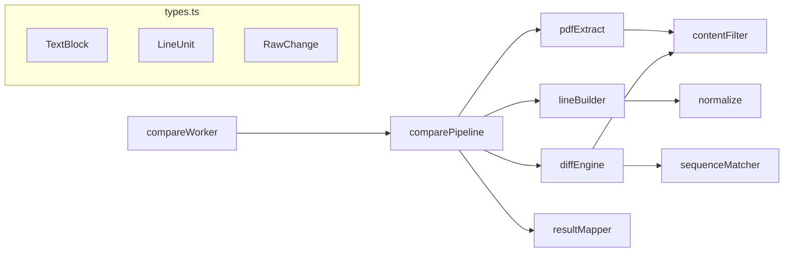

# 前端 PDF 比对算法处理链路

本文档描述 `frontend/src/lib/compare` 目录下，从 PDF 输入到 UI 可用比对结果的完整处理路径。

## 总览

```mermaid
flowchart TB
  subgraph entry [入口层]
    A1[comparePdfFiles] --> A2[comparePdfBuffers]
    W[compareWorker.ts] --> A2
    H[useFrontendCompare] --> W
  end

  subgraph extract [阶段 1 · PDF 提取]
    A2 --> E1[extractTextBlocks × 2 并行]
    E1 --> E2[extractPageBlocks 逐页]
    E2 --> E3[groupItemsIntoLines]
    E3 --> E4[cleanWatermarkText]
    E4 --> TB[(TextBlock[])]
  end

  subgraph line [阶段 2 · 行构建]
    TB --> L1[blocksToLines]
    L1 --> L2[normalize]
    L1 --> LU[(LineUnit[])]
  end

  subgraph diff [阶段 3 · 字符 Diff]
    LU --> D1[diffLines]
    D1 --> D2[excludeNonContent]
    D2 --> D3[textStreamFromLines]
    D3 --> D4[getAnchoredOpcodes]
    D4 --> D5[getOpcodes / fast-diff]
    D5 --> D6[emit*Changes + bbox 反查]
    D6 --> RC[(RawChange[])]
  end

  subgraph map [阶段 4 · 结果映射]
    RC --> M1[buildCompareResult]
    M1 --> CR[(CompareResult)]
  end
```

---

## 入口

| 入口 | 文件 | 说明 |
|------|------|------|
| `comparePdfFiles` | `comparePipeline.ts` | `File` → `ArrayBuffer`，再进入主流程 |
| `comparePdfBuffers` | `comparePipeline.ts` | 主流程编排函数 |
| `compareWorker.ts` | `compareWorker.ts` | Web Worker 后台线程，调用 `comparePdfBuffers` |
| `useFrontendCompare` | `hooks/useFrontendCompare.ts` | React Hook，通过 Worker 触发比对 |

**默认选项**（`CompareOptions`）：

- `ignore_whitespace: true` — 比对前去除空白
- `ignore_header_footer: true` — 过滤页眉页脚区域的页码行

---

## 阶段 1：PDF 文本提取

**文件：** `pdfExtract.ts` → `contentFilter.ts`

```
ArrayBuffer
  └─ extractTextBlocks
       └─ getDocument (pdf.js)
            └─ extractPageBlocks (每页并行)
                 ├─ page.getTextContent()
                 ├─ itemFromTextItem        → 单 TextItem 转 ItemEntry，清洗水印
                 ├─ groupItemsIntoLines     → 按垂直中心距聚合成行
                 ├─ buildLineGroup          → 拼接行内 item，再次清洗水印
                 └─ 页眉/页脚过滤            → isPageNumber (contentFilter)
```

**输出：** `PdfExtractResult`

```ts
{
  blocks: TextBlock[]      // 含 page / text / bbox / fontSize / charBboxes
  pageSizes: PdfPageSize[] // 每页 width / height
}
```

**关键子步骤：**

| 函数 | 作用 |
|------|------|
| `toTopLeftBBox` | PDF.js 基线坐标 → 页面左上原点 bbox |
| `charBboxesForItem` | 按等宽假设估算每个字符 bbox |
| `stripWatermarkChars` | 过滤 bbox 偏高的水印字符 |
| `stripLeadingNumericWatermark` | 剥离行首数字水印前缀 |
| `groupItemsIntoLines` | 垂直中心距 < 半行高 → 同一行 |

---

## 阶段 2：行构建与规范化

**文件：** `lineBuilder.ts` → `normalize.ts`

```
TextBlock[]
  └─ blocksToLines
       ├─ 按 page → y → x 排序
       ├─ sameLine 判定聚合成行
       ├─ buildLine 合并同行 block，拼接 charBboxes
       ├─ normalize(text, ignoreWhitespace)  → normalized 文本
       ├─ computeRawNonWsPositions           → 非空白字符原始下标
       └─ 过滤 normalized 为空的行
```

**输出：** `LineUnit[]`（模版侧 prefix=`tpl`，合同侧 prefix=`con`）

**normalize 规则：**

1. `trim`
2. 可选：去除全部空白（`\s+`）
3. 中文标点统一为半角（`，。；（）：` 等）

---

## 阶段 3：字符级 Diff

**文件：** `diffEngine.ts` → `sequenceMatcher.ts` → `contentFilter.ts`

### 3.1 构建文本流

```
LineUnit[]
  └─ excludeNonContent          → 过滤页码等无实质内容行
  └─ textStreamFromLines
       ├─ 拼接各 line.normalized → TextStream.text
       ├─ 行尾 `-` 与下一行连字（PDF 断词）
       └─ charMap[]              → 每个字符 → { lineIndex, rawPos }
```

### 3.2 锚点分段 Diff

大文档不整篇做 Myers，而是按**相同 normalized 行**找锚点，分段 diff：

```
getAnchoredOpcodes
  ├─ buildLineRanges            → 每行在文本流中的 [start, end)
  ├─ 在合同侧建 normalized → 行索引 Map
  ├─ 按模版行顺序匹配锚点对（合同侧位置单调递增）
  ├─ 锚点之间的缝隙 → getOpcodes (局部 diff)
  ├─ offsetOpcodes              → 局部坐标 → 全局坐标
  └─ 锚点行本身视为 equal，跳过
```

### 3.3 字符 Diff 引擎

**文件：** `sequenceMatcher.ts`

```
getOpcodes(a, b)
  ├─ trimEqualAffixes           → 裁剪首尾相同字符
  └─ opcodesFromFastDiff
       └─ fast-diff (Myers 类算法)
            → Opcode[] { tag, i1, i2, j1, j2 }
```

`Opcode.tag`：`delete` | `insert` | `replace` | `equal`

### 3.4 Opcode → RawChange（含 bbox）

```
diffLines
  └─ resolveOpcodes → getAnchoredOpcodes
  └─ 遍历 Opcode，按 tag 分发：
       ├─ delete  → emitSideChanges
       ├─ insert  → emitInsertChanges (+ getAnchorSlice 模版侧锚点)
       └─ replace → emitReplaceChanges (同页合并 / 否则拆 delete+insert)
            └─ sliceByPage          → 按页拆分片段
            └─ bboxesForRawPositions → charMap → charBboxes → mergeAdjacent
            └─ shouldReport         → 过滤布局噪声 (isLayoutOnly)
```

**输出：** `RawChange[]`

```ts
{
  type: 'delete' | 'insert' | 'replace'
  level: 'char'
  templateLines / contractLines   // 变更片段对应的 LineUnit
  templateBboxes / contractBboxes // PDF 高亮区域 [x0,y0,x1,y1][]
}
```

---

## 阶段 4：结果映射

**文件：** `resultMapper.ts`

```
RawChange[] + LineUnit[] + pageSizes
  └─ buildCompareResult
       ├─ toChangeItem     → RawChange → ChangeItem (id: c0001…)
       ├─ toLineInfo       → LineUnit → LineInfo
       └─ 统计 summary     → deleted / inserted / modified / equal lines
```

**输出：** `CompareResult`（`types/compare.ts`），供 UI 渲染差异列表与 PDF 高亮。

---

## 模块依赖关系



---

## 数据类型流转

```
File / ArrayBuffer
    ↓ extractTextBlocks
TextBlock[] + PdfPageSize[]
    ↓ blocksToLines
LineUnit[]
    ↓ diffLines
RawChange[]
    ↓ buildCompareResult
CompareResult  →  UI (ChangeList / DiffOverlay / InlineTextDiff)
```

---

## 文件索引

| 文件 | 职责 |
|------|------|
| `comparePipeline.ts` | 主流程编排 |
| `compareWorker.ts` | Worker 入口 |
| `pdfExtract.ts` | PDF.js 文本与字符 bbox 提取 |
| `lineBuilder.ts` | TextBlock → LineUnit 行聚合 |
| `normalize.ts` | 文本规范化 |
| `contentFilter.ts` | 页码识别、无内容行过滤 |
| `diffEngine.ts` | 文本流构建、锚点 diff、bbox 反查、RawChange 生成 |
| `sequenceMatcher.ts` | fast-diff 封装、bbox 合并 |
| `resultMapper.ts` | RawChange → CompareResult |
| `types.ts` | 模块内部类型定义 |
